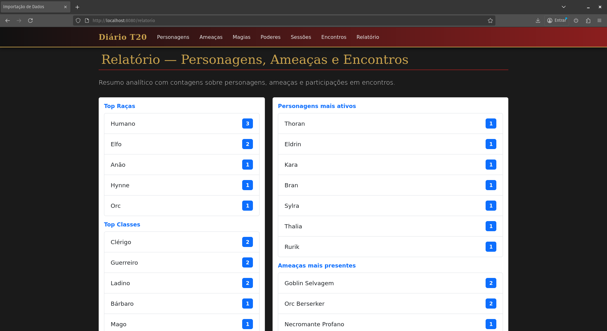

# 🏰 Registro de Sessões de RPG — Tormenta20

Aplicação web em desenvolvimento usando **Spring Boot**, **Spring MVC**, **Thymeleaf**, **Bootstrap** e **H2 Database** para registrar e organizar informações de campanhas no sistema **Tormenta20**. Objetivo: armazenar personagens, ameaças, encontros e sessões, criando um histórico visual e persistido da campanha.

> 🔥 Referência de estrutura, padrões e práticas: [**Torresmo**](https://github.com/angoti/torresmo) (por @angoti).

## 👥 Criado por

- **Arthur Gabriel de Freitas Dantas Morais** — repositório: [@ArthurGabrielFreitas](https://github.com/ArthurGabrielFreitas)  
- **Fernando Almeida** — repositório: [@Fernando-alme](https://github.com/Fernando-alme)

Contribuições e melhorias são bem‑vindas — abra issues ou pull requests no repositório.

---

## 🚀 Tecnologias utilizadas

| Tecnologia      | Uso                                          |
| --------------- | -------------------------------------------- |
| Spring Boot     | Base da aplicação e gestão das dependências  |
| Spring MVC      | Estruturação do padrão Model-View-Controller |
| Thymeleaf       | Templates HTML integrados com o backend      |
| Bootstrap       | Estilização responsiva da interface          |
| H2 Database     | Banco em memória para desenvolvimento        |
| JPA / Hibernate | Mapeamento e persistência das entidades      |

---

## 🧭 Introdução

Sistema simples para auxiliar mestres e jogadores a registrar o histórico das campanhas — personagens, ameaças, encontros e sessões — com interface web baseada em Thymeleaf. Foco atual: operação mestre/detalhe envolvendo Encontros e Sessões.

Responsabilidades principais:
- Persistir entidades do jogo (Personagem, Ameaça, Magia, Poder, Encontro, Sessão)
- Permitir CRUDs sobre as entidades principais
- Suportar operação mestre/detalhe: Sessão (mestre) → Encontros (detalhes) → Participações
- Gerar relatórios simples em HTML para exportação/impressão

---

## 🧩 Modelo de domínio (visão geral)

Entidades principais:
- Personagem: dados do personagem (nome, atributos, status, …)
- Ameaça: inimigos, monstros ou NPCs hostis com atributos de combate
- Encontro: registro de um combate/encenação dentro de uma sessão
- Sessão: sessão de jogo — data, descrição e lista de encontros
- Participacao (ParticipacaoEncontro): ligação entre Encontro e Personagem/Ameaça com campos extras (morte, último golpe, anotações)
- Magia / Poder: habilidades associadas a personagens/ameaças

Relações importantes:
- Uma Sessão possui vários Encontros (1:N)
- Um Encontro possui várias Participações (N:1 para Personagem/Ameaça via Participacao)

Diagrama simplificado (texto):

Sessão 1 — N Encontro 1 — N Participação N — 1 Personagem  
\-- N Participação N — 1 Ameaça

---

## 🔁 CRUDs

Padrão de recursos e rotas (exemplo):

- Personagem
    - Listar: GET /personagens
    - Formulário de criação: GET /personagens/novo
    - Criar: POST /personagens
    - Editar: GET /personagens/editar/{id}
    - Deletar: POST/GET /personagens/excluir/{id}

Observação: os nomes exatos das rotas seguem a convenção dos controllers do projeto — ver `src/main/java/br/com/diario/controller`.

---

## 🔗 Operação mestre/detalhe

Mestre: Sessão — contém metadados (data, título, observações) e referencia os encontros.  
Detalhe: Encontro — cada encontro pertence a uma sessão e contém várias participações.

Fluxo de edição/salvamento (alto nível):
1. Formulário de criação/edição de Sessão permite adicionar/editar Encontros vinculados.
2. Cada Encontro possui participações; a view envia apenas os ids selecionados para personagens/ameaças e campos auxiliares por id (ex.: `anotacoes_personagem_{id}`).
3. No backend o controller reúne os ids enviados, resolve as entidades (via repositório), preserva ids de Participacao existentes quando informado e atualiza/cria registros conforme necessário.

Nota técnica (binding id-based para Encontro):
- O template envia listas de ids (ex.: `personagensSelecionados`, `ameacasSelecionadas`) e campos nomeados por id.
- Essa abordagem evita problemas de indexação no HTML e facilita atualização seletiva de participações já existentes.

Vantagens:
- Robustez na atualização de coleções complexas
- Independência da ordem dos elementos no DOM

---

## 📊 Relatórios

Relatórios gerados em HTML (Thymeleaf) para exibição/impressão. Exemplos:
- Relatório de Sessão — lista de encontros e resumo das participações
- Relatório de Encontro — detalhes de um encontro específico, com ações e anotações

---

## 🖼️ Prints das telas (placeholders)

Substitua os caminhos abaixo pelas imagens reais do projeto. Coloque as imagens e atualize os `src`.

- Tela inicial 
    

- Personagens — Lista  
    

- Personagens — Formulário  
    

- Ameaças — Lista  
    

- Ameaças — Formulário  
    

- Encontros — Lista  
    

- Encontros — Formulário (participações)  
    

- Sessões — Lista  
    

- Sessões — Detalhes  
    

- Relatório
    

Observação: crie a pasta `docs/screens/` (ou outro caminho) e atualize os `src`.

---

## ▶️ Instruções de execução

Pré-requisitos:
- Java 17+ (testado com JDK 17/19; prefira LTS)
- Maven (opcional se usar o wrapper `./mvnw`)

Passos rápidos:

1. Clone o repositório
```bash
git clone https://github.com/ArthurGabrielFreitas/Projeto-Web-MVC-diario-RPG.git
cd Projeto-Web-MVC-diario-RPG/diario_de_aventura
```

2. Rodar via Maven wrapper:
```bash
./mvnw spring-boot:run
```
Ou empacotar e executar o JAR:
```bash
./mvnw clean package
java -jar target/diario_de_aventura-1.0.0.jar
```

3. Acesse a aplicação:
http://localhost:8080

4. Console H2 (dev):
http://localhost:8080/h2-console

Verifique `src/main/resources/application.properties` para ajustar conexões ou porta.

---

## 🏗️ Arquitetura do sistema

Camadas:
- Controller (Web) — recebe requests HTTP, valida e delega para services  
- Service — lógica de negócio e orquestração entre repositórios  
- Repository (JPA) — persistência via Spring Data JPA  
- Model / Entity — classes do domínio  
- View — templates Thymeleaf em `src/main/resources/templates`  
- Recursos estáticos — CSS/JS/Imagens em `src/main/resources/static`

Padrões usados:
- MVC (Model-View-Controller)
- Repositório (Spring Data JPA)
- Templates server-side (Thymeleaf)

Possíveis evoluções:
- Separar front-end em SPA (React/Vue) e expor API REST
- Adicionar autenticação/autorização (Spring Security)
- Migrar para banco relacional externo (PostgreSQL/MySQL)

---

## 🔍 Observações técnicas e dicas

- Encontros usam binding id-based para tratar coleções de participações — ver `EncontroController` e templates em `templates/encontro/`.
- Para testes rápidos, revise o `DataLoader` (ou equivalente) que popula dados de exemplo na inicialização.

---

## 📜 Licença

Defina a licença desejada (MIT, Apache-2.0, etc.) se for compartilhar publicamente.
